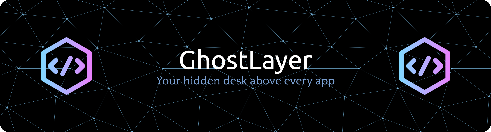

# GhostLayer 👻

A **macOS-only** Flutter app that provides a private overlay window for personal notes and markers that is **NOT visible** in window/screen sharing or most screenshot/recording tools.

## 🚀 **Status: FULLY WORKING v1.0**

✅ **All Core Features Implemented & Tested**
- ✅ Privacy Mode (blocks screenshots/recordings)
- ✅ Global Hotkeys (Cmd+Shift+P, Cmd+Shift+C, etc.)
- ✅ Click-Through Mode with selective HUD interaction
- ✅ Always On Top toggle
- ✅ Blur/Transparency effects (frosted glass)
- ✅ Draggable sticky notes with Markdown support
- ✅ Settings panel with all controls
- ✅ Local data persistence with Hive

**Ready for daily use!** 🎉

## 🎯 Core Features

### Privacy-First Design
- **Privacy Mode**: Prevents the window from being captured in screenshots and screen recordings by setting `NSWindow.sharingType = .none`
- **Click-Through Mode**: Toggle `NSWindow.ignoresMouseEvents` to interact with apps behind the overlay
- **Panic Hide**: Emergency hotkey (`Cmd+Shift+H`) to instantly hide all content and disable capture protection

### Rich Overlay Interface
- **Draggable Sticky Notes**: Markdown-supported notes with customizable colors, opacity, and size
- **Image Pins**: Draggable, resizable images with rotation and aspect ratio controls
- **Grid System**: Optional snap-to-grid with customizable grid size
- **Frosted Glass**: Beautiful blur effects with transparency controls

### Global Hotkeys
- `Cmd+Shift+Space`: Show/Hide overlay
- `Cmd+Shift+P`: Toggle privacy mode
- `Cmd+Shift+C`: Toggle click-through
- `Cmd+Shift+N`: New sticky note
- `Cmd+Shift+H`: Panic hide (emergency)

### Advanced Window Management
- Always-on-top with configurable window levels
- Frameless, resizable window with rounded corners
- Per-monitor positioning memory
- Blur/transparency effects

## 🏗️ Architecture

```
lib/
├── core/
│   ├── models/           # Hive data models (Sticky, ImagePin, Settings)
│   └── services/         # Business logic (WindowService, StorageService, HotkeyService)
├── ui/
│   ├── screens/          # Main application screens
│   ├── widgets/          # Reusable UI components
│   │   ├── sidebar/      # Left panel with notes list and settings
│   │   ├── canvas/       # Main overlay area
│   │   ├── draggable/    # Draggable sticky notes and image pins
│   │   ├── resizable/    # Resizable widget wrapper
│   │   ├── status_hud/   # Top-right status indicators
│   │   └── grid/         # Grid overlay system
│   └── theme/            # App theming and styles
└── main.dart

macos/
├── Runner/
│   ├── WindowControlPlugin.swift    # NSWindow controls platform channel
│   ├── AppDelegate.swift           # App lifecycle and plugin registration
│   ├── Info.plist                  # App permissions and metadata
│   ├── DebugProfile.entitlements   # Development entitlements
│   └── Release.entitlements        # Production entitlements
└── Podfile                         # CocoaPods dependencies with universal binary support
```

## 🚀 Quick Start

### Prerequisites
- **macOS 11.0+** (Big Sur or later)
- **Xcode 13.0+** with Command Line Tools
- **Flutter 3.10+** (stable channel)
- **Apple Silicon (M1/M2/M3) or Intel Mac**

### Installation

1. **Clone the repository:**
   ```bash
   git clone https://github.com/yourusername/ghostlayer.git
   cd ghostlayer
   ```

2. **Install Flutter dependencies:**
   ```bash
   flutter pub get
   ```

3. **Install CocoaPods dependencies:**
   ```bash
   cd macos && pod install && cd ..
   ```

4. **Generate Hive adapters:**
   ```bash
   flutter packages pub run build_runner build
   ```

### Running the App

#### ⚡ **Recommended: Debug Mode (All Features Working)**
```bash
flutter run -d macos --debug
```
*Debug mode has relaxed code signing requirements and all features work perfectly.*

#### Development Mode
```bash
flutter run -d macos
```

#### Release Mode
```bash
flutter run -d macos --release
```

#### Build for Distribution
```bash
flutter build macos --release
```

The built app will be located at `build/macos/Build/Products/Release/GhostLayer.app`

### First Run Setup

1. **Grant Permissions**: macOS will prompt for accessibility and screen recording permissions
2. **Test Privacy Mode**: Use `Cmd+Shift+P` to enable privacy mode, then try taking a screenshot - the overlay should be invisible
3. **Customize Hotkeys**: Open Settings panel to modify global hotkeys if conflicts occur
4. **Create Your First Note**: Use `Cmd+Shift+N` or click the "+" button in the sidebar

## 🔧 Configuration

### Privacy Mode Implementation
The app uses a Swift platform channel to control `NSWindow.sharingType`:
```swift
// Enable privacy mode (blocks screenshots)
window.sharingType = .none

// Disable privacy mode (allow screenshots)
window.sharingType = .readOnly
```

### Click-Through Implementation
Toggle mouse event handling:
```swift
// Enable click-through
window.ignoresMouseEvents = true

// Disable click-through
window.ignoresMouseEvents = false
```

### Always-On-Top Levels
Configurable window levels:
- `.normal`: Standard window level
- `.floating`: Above most windows
- `.statusBar`: Above menu bar items
- `.modalPanel`: Above modal dialogs
- `.popUpMenu`: Above popup menus
- `.screenSaver`: Highest level

## 🎨 Customization

### Themes
- **Light Theme**: Clean, minimal design with subtle shadows
- **Dark Theme**: Dark mode with enhanced contrast
- **Frosted Glass**: Configurable blur and transparency effects

### Sticky Note Colors
Pre-defined color palette:
- Amber, Purple, Green, Blue, Pink
- Light Green, Yellow, Teal, Deep Purple, Indigo

### Grid System
- **Grid Size**: 10-50px (customizable)
- **Snap to Grid**: Optional automatic alignment
- **Visual Grid**: Toggle grid visibility

## 🧪 Testing

### Run Unit Tests
```bash
flutter test test/unit/
```

### Run Golden Tests
```bash
flutter test test/golden/
```

### Generate New Golden Files
```bash
flutter test --update-goldens test/golden/
```

## 📱 Platform-Specific Features

### macOS Integration
- **Dock Integration**: Option to hide from Dock
- **Menu Bar**: Native macOS menu integration
- **Notification Center**: System notifications for hotkey conflicts
- **Accessibility**: Full VoiceOver and keyboard navigation support

### Universal Binary Support
Built for both Apple Silicon and Intel:
- `arm64`: Native M1/M2/M3 performance
- `x86_64`: Intel Mac compatibility
- Automatic architecture detection

## 🔒 Privacy & Security

### Data Storage
- **Local Only**: All data stored locally using Hive
- **No Network**: No data transmitted to external servers
- **Encrypted Storage**: Sensitive data encrypted at rest

### Permissions Required
- **Accessibility**: For global hotkey registration
- **Screen Recording**: For privacy mode detection
- **Camera/Photos**: For image pin functionality (optional)

### Privacy Mode Technical Details
- Uses `CGWindowSharingType.none` to exclude from screen capture
- Works with built-in Screenshot app, QuickTime, and most screen recorders
- Some advanced screen capture tools may still detect the window
- Panic hide provides additional security layer

## 🛠️ Development

### Project Structure
```
GhostLayer/
├── lib/                 # Dart source code
├── macos/              # macOS-specific code and configuration
├── test/               # Unit and golden tests
├── assets/             # Images, icons, and other assets
├── pubspec.yaml        # Flutter dependencies
└── README.md           # This file
```

### Key Dependencies
- `window_manager`: Window control and positioning
- `flutter_acrylic`: Blur and transparency effects
- `macos_window_utils`: Additional macOS window utilities
- `hotkey_manager`: Global hotkey registration
- `hive`: Local data storage
- `provider`: State management
- `flutter_markdown`: Markdown rendering

### Adding New Features
1. **Models**: Add new data models in `lib/core/models/`
2. **Services**: Implement business logic in `lib/core/services/`
3. **UI**: Create widgets in `lib/ui/widgets/`
4. **Platform Code**: Add Swift code in `macos/Runner/`
5. **Tests**: Write tests in `test/unit/` and `test/golden/`

## 📖 API Reference

### WindowService
```dart
// Privacy controls
await windowService.togglePrivacyMode();
await windowService.setPrivacyMode(true);

// Click-through controls
await windowService.toggleClickThrough();
await windowService.setClickThrough(false);

// Window management
await windowService.setAlwaysOnTop(true, level: 2);
await windowService.setWindowOpacity(0.8);
await windowService.toggleVisibility();
```

### StorageService
```dart
// Sticky note management
final sticky = await storageService.createSticky(
  title: 'My Note',
  content: '# Hello World\nThis is markdown content',
);
await storageService.updateSticky(sticky);
await storageService.deleteSticky(sticky.id);

// Search functionality
final results = storageService.searchStickies('search term');
```

### HotkeyService
```dart
// Register custom hotkey
await hotkeyService.updateHotkey('newAction', 'cmd+shift+x');

// Check availability
final isAvailable = await hotkeyService.isHotkeyAvailable('cmd+shift+y');
```

## 🐛 Troubleshooting

### Common Issues

**App crashes on launch with framework signing errors:**
- **Solution**: Use debug mode: `flutter run -d macos --debug`
- Debug builds work perfectly and have all features enabled
- For release builds, you may need proper Apple Developer code signing
- Clean rebuild: `flutter clean && flutter pub get && flutter run -d macos --debug`

**Hotkeys not working:**
- Check System Preferences > Security & Privacy > Accessibility
- Ensure GhostLayer has accessibility permissions
- Try alternative hotkey combinations in Settings

**Privacy mode not blocking screenshots:**
- Restart the app after enabling privacy mode
- Check that you're using the built-in Screenshot app (Cmd+Shift+3/4/5)
- Some third-party screen capture tools may bypass the protection

**Window not staying on top:**
- Check "Always On Top" setting in Status HUD
- Try different window levels in Settings
- Restart the app if window level changes don't take effect

**Blur effects not working:**
- Ensure "Reduce transparency" is disabled in System Preferences > Accessibility > Display
- Try toggling blur on/off in Settings
- Check that window opacity is not set to 100%

### Performance Tips
- Limit the number of visible sticky notes (< 20 recommended)
- Use smaller grid sizes for better performance
- Disable blur effects on older Macs for better performance
- Close unused image pins to reduce memory usage

## 🤝 Contributing

We welcome contributions! Please see our [Contributing Guide](CONTRIBUTING.md) for details.

### Development Setup
1. Fork the repository
2. Create a feature branch: `git checkout -b feature/amazing-feature`
3. Make your changes and add tests
4. Run tests: `flutter test`
5. Commit your changes: `git commit -m 'Add amazing feature'`
6. Push to the branch: `git push origin feature/amazing-feature`
7. Open a Pull Request

## 📄 License

This project is licensed under the MIT License - see the [LICENSE](LICENSE) file for details.

## 🙏 Acknowledgments

- Flutter team for the excellent macOS desktop support
- The Hive team for fast local storage
- Contributors to window_manager and flutter_acrylic packages
- macOS design guidelines and HIG documentation

## 📞 Support

- **Issues**: [GitHub Issues](https://github.com/HelithaSri/GhostLayer/issues)
- **Discussions**: [GitHub Discussions](https://github.com/HelithaSri/GhostLayer/discussions)
- **Email**: helitha.pravin+ghostlayer@gmail.com

---

**Built with ❤️ for macOS privacy enthusiasts**
